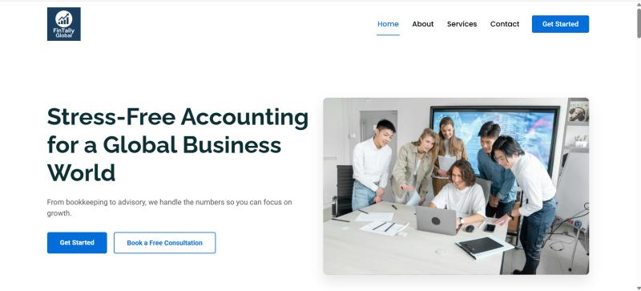
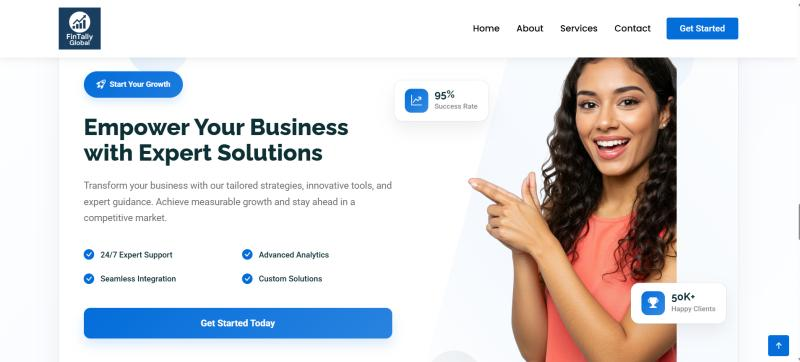
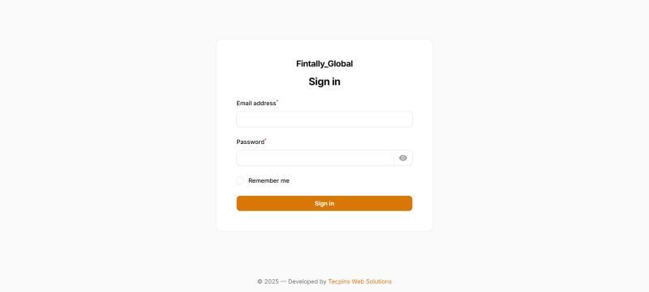
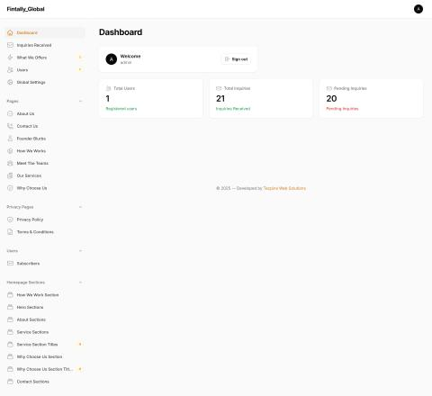

# Fintally Global – Enterprise Accounting & Financial Platform

**Fintally Global** is a professional-grade accounting services platform engineered to support international clients. The project combines a modern, trust-building frontend with a powerful, secure backend to manage complex financial service workflows including US-GAAP and IFRS compliance.

🔗 **Live Website:** [https://www.fintallyglobal.com/](https://www.fintallyglobal.com/)

---

## 🚀 Technical Architecture

### **Backend & Admin Management**
* **Framework:** **Laravel 10** for a secure, scalable MVC architecture.
* **Admin Panel:** **Filament 3** (TALL Stack) for a high-performance dashboard to manage inquiries, services, and internal workflows.
* **Database:** MySQL with optimized indexing for financial data structures.

### **Frontend & UI/UX**
* **Design:** Corporate-grade UI optimized for credibility and global lead generation.
* **Responsiveness:** Fully fluid design using Bootstrap and custom CSS.
* **Performance:** Optimized for international traffic with fast-loading assets and secure architecture.

---

## ✨ Key Features
* **Global Service Modules:** Dedicated sections for Monthly Bookkeeping, Catch-up/Clean-up, and AP/AR management.
* **Dynamic Content Management:** Admin ability to update service offerings and company news in real-time via the Filament dashboard.
* **Lead Generation Engine:** Optimized user flow and secure contact integration for high-conversion global inquiries.
* **SEO & Analytics:** Structured for high visibility in the global financial services market.

---

## 📸 Project Showcase
> *Visual highlights of the user interface and the Laravel-powered management system.*

| Frontend Interface | About | Call to Action | 
|---|---|---|
|  |  |  |

| Filament 3 Dashboard (Admin Login) | Dashboard |
|---|---|
|  |  |

---

## 🔒 Confidentiality Notice
This repository serves as a **professional showcase**. To protect intellectual property and the client's proprietary financial modules, the source code is kept in a private repository. 

For technical inquiries or custom enterprise development, visit [Tecpins Web Solutions](https://tecpinswebsolutions.lk/).

---

### 👨‍💻 Developed By
**Prasad Chinthaka** *Professional Accountant & Full-Stack Developer* **Tecpins Web Solutions**
